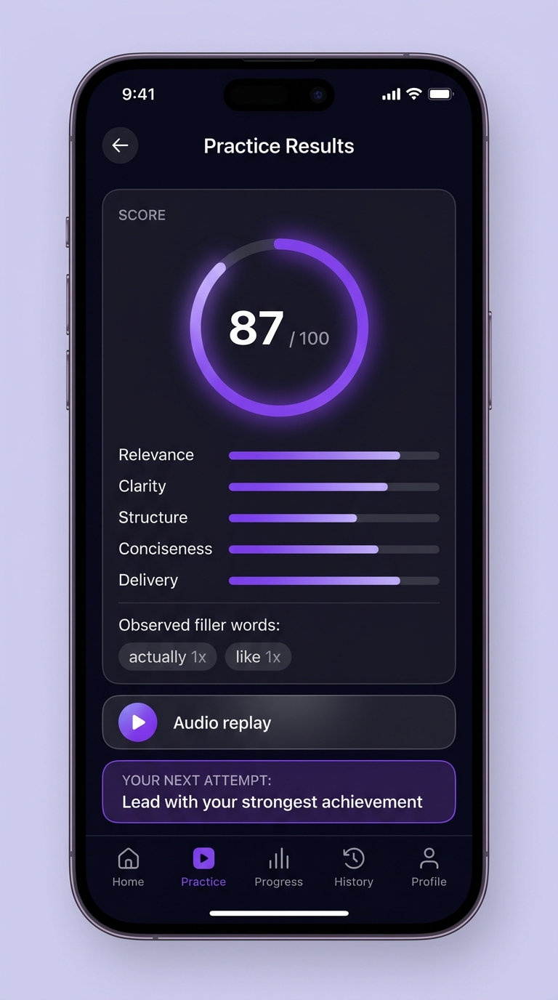

# 🎤 PitchMe

> **Practice your answer. Improve your pitch. Ace the conversation.**

PitchMe is an AI-powered voice interview coach that lets students and job seekers practice realistic interview questions, receive personalized communication feedback, and repeatedly improve their answers through measurable progress.

<p align="center">
  
</p>

---

## 🎯 The Problem PitchMe Solves

Most candidates prepare for interviews by reading lists of common questions, watching YouTube videos, or memorizing AI-generated responses. However, knowing what to say isn't the same as being able to say it well.

Candidates frequently struggle with:
- Speaking for too long or rambling
- Giving vague answers without measurable proof
- Lack of clear structure
- Excessive filler words (*"actually"*, *"like"*, *"basically"*)
- Not knowing whether their delivery is actually getting better

**PitchMe bridges the gap between:**
> *"I know the answer"* ➔ *"I can confidently communicate the answer."*

---

## 💡 The Core Loop: Beat Your Answer

1. **Question**: Clear, focused interview prompt with recommended response window and framework coaching cue.
2. **🎙️ Verbal Recording**: User speaks directly into the microphone with live audio-reactive waveform & timer.
3. **🤖 AI Analysis**: Animated multi-step evaluation (*Transcribing → Understanding → Evaluating Communication → Preparing Feedback*).
4. **📊 5-Metric Scoring & Feedback**:
   - **Relevance**: Did the user actually answer the question?
   - **Clarity**: Was the response understandable and articulate?
   - **Structure**: Logical progression (*Present → Proof → Result → Goal*).
   - **Conciseness**: Efficient communication within recommended duration.
   - **Delivery**: Pacing, pauses, and observable filler word frequencies.
5. **🔁 Retry ("Beat your answer")**: Immediate retry loop.
6. **📈 Side-by-Side Comparison**: First vs Latest attempt score trajectory (*61 → 74 → 87, +26 points!*) and personal best per question.

---

## 🏠 App Architecture & Structure

```text
pitchme/
├── App.tsx                     # Navigation orchestrator & global state
├── src/
│   ├── types/
│   │   ├── interview.ts        # Categories, difficulties, questions, session configs
│   │   ├── analysis.ts         # Scoring metrics, filler words, feedback, attempts
│   │   └── user.ts             # Profile, streak, history, subscriptions
│   ├── data/
│   │   ├── mockQuestions.ts    # Curated questions (Job, Placement, Internship, Technical, Viva) across Easy, Medium, Hard
│   │   └── initialData.ts      # Initial user stats, session history, streaks
│   ├── components/
│   │   ├── ScoreRing.tsx       # Circular score visualizer
│   │   ├── MetricBar.tsx       # Horizontal metric progress bars with attempt deltas
│   │   ├── Waveform.tsx        # Voice-reactive audio waveform visualizer
│   │   ├── AudioPlayer.tsx     # Audio replay button for recorded answers
│   │   ├── AnalysisLoader.tsx  # Step-by-step AI evaluation loader
│   │   ├── AttemptCompare.tsx  # Side-by-side metric comparison table & score leap
│   │   ├── BottomNav.tsx       # 5-tab persistent bottom navigation
│   │   └── PrimaryButton.tsx   # Tactile high-contrast CTA buttons
│   ├── screens/
│   │   ├── WelcomeScreen.tsx   # First-launch onboarding / brand splash
│   │   ├── HomeScreen.tsx      # Daily streak, quick start, recent sessions, stats
│   │   ├── PracticeSetupScreen.tsx # Interview category, difficulty & question count
│   │   ├── InterviewScreen.tsx # Focused interview environment
│   │   ├── RecordingScreen.tsx # Live audio recording with waveform, timer, stop action
│   │   ├── ResultsScreen.tsx   # 5-metric score, What worked, What to improve, Filler words, Next attempt tip
│   │   ├── ComparisonScreen.tsx# "Beat Your Answer" comparison & Personal Best celebration
│   │   ├── ProgressScreen.tsx  # "Am I actually getting better?", 4-week trend, strengths & focus areas
│   │   ├── HistoryScreen.tsx   # Grouped session history with replay & result viewing
│   │   ├── ProfileScreen.tsx   # User profile, streak, settings, privacy controls
│   │   └── PaywallModal.tsx    # PitchMe Pro modal with monthly/yearly plans
│   └── services/
│       ├── audioService.ts     # Expo-AV recording & playback with permission handling
│       └── analysisEngine.ts   # AI analysis engine generating structured metrics & coaching cues
```

---

## 🚀 Running Locally

### Install dependencies
```sh
npm install
```

### Run with Expo
```sh
npm run start
```
- Press `w` to open in your web browser.
- Press `a` to open on an Android emulator or scan the QR code using **Expo Go** on an Android device.

### Android Build
To generate a standalone APK preview via EAS:
```sh
npx eas-cli build --platform android --profile preview
```

---

## 🔒 Privacy: Your Voice, Your Data
- Microphone permissions are requested solely for audio evaluation.
- Users can clear recordings, transcripts, and session history at any time from the **Profile** screen.
