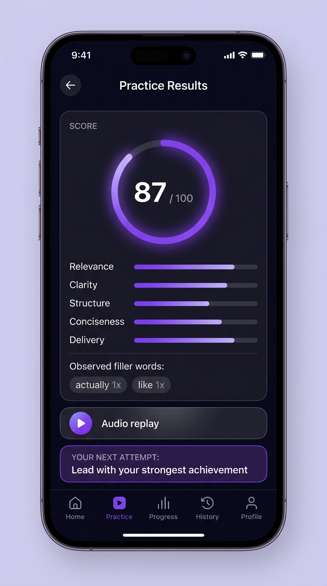

# 🎤 PitchMe

> **Practice your answer. Improve your pitch. Ace the conversation.**

🌐 **Live Web App (Shareable Link)**: [https://kshethrarajith.github.io/PitchMe/](https://kshethrarajith.github.io/PitchMe/)

PitchMe is an AI-powered voice interview coach that lets students and job seekers practice realistic interview questions, receive personalized communication feedback, and repeatedly improve their answers through measurable progress.

<p align="center">
  
</p>

---

## 🎯 The Problem PitchMe Solves

Most candidates prepare for interviews by reading lists of common questions, watching YouTube videos, or memorizing AI-generated responses. However, knowing what to say isn't the same as being able to say it well.

Candidates frequently struggle with:
- Speaking for too long or rambling
- Giving vague answers without measurable proof
- Lack of clear structure
- Excessive filler words (*"actually"*, *"like"*, *"basically"*)
- Not knowing whether their delivery is actually getting better

**PitchMe bridges the gap between:**
> *"I know the answer"* ➔ *"I can confidently communicate the answer."*

---

## 💡 The Core Loop: Beat Your Answer

1. **Question**: Clear, focused interview prompt with recommended response window and framework coaching cue.
2. **🎙️ Verbal Recording**: User speaks directly into the microphone with live audio-reactive waveform & timer.
3. **🤖 AI Analysis**: Animated multi-step evaluation (*Transcribing → Understanding → Evaluating Communication → Preparing Feedback*).
4. **📊 5-Metric Scoring & Feedback**:
   - **Relevance**: Did the user actually answer the question?
   - **Clarity**: Was the response understandable and articulate?
   - **Structure**: Logical progression (*Present → Proof → Result → Goal*).
   - **Conciseness**: Efficient communication within recommended duration.
   - **Delivery**: Pacing, pauses, and observable filler word frequencies.
5. **🔁 Retry ("Beat your answer")**: Immediate retry loop.
6. **📈 Side-by-Side Comparison**: First vs Latest attempt score trajectory (*61 → 74 → 87, +26 points!*) and personal best per question.

---

## 🛠️ Technology Stack

| Category | Technologies & Tools |
| :--- | :--- |
| **Languages** | TypeScript (`~5.3.3`), JavaScript (Node.js), HTML5, YAML, JSON |
| **Frameworks** | React Native (`0.76.3`), Expo SDK (`~52.0.0`), React (`18.3.1`), React Native Web (`~0.19.13`) |
| **Mobile & Audio** | `expo-av`, `expo-linear-gradient`, `expo-asset`, `expo-status-bar` |
| **Web Audio APIs** | `MediaRecorder` API (`audio/webm`), `navigator.mediaDevices.getUserMedia`, HTML5 Audio |
| **Platforms** | Web (Responsive SPA/PWA), Android (APK/AAB), iOS |
| **Cloud & Hosting** | GitHub Pages (Static Hosting), Expo Application Services (EAS Build) |
| **CI/CD Automation** | GitHub Actions (Automated build & deployment pipeline) |
| **State & Data** | React Hooks (`useState`, `useRef`), Client-side In-Memory Storage & Mock Datasets |
| **Engine** | Modular 5-Metric Communication Analysis Engine ([src/services/analysisEngine.ts](./src/services/analysisEngine.ts)) |

---

## 🏠 App Architecture & Structure

```text
pitchme/
├── App.tsx                     # Navigation orchestrator & global state
├── app.json                    # Expo & native application configuration
├── eas.json                    # EAS Build profiles (preview APK & production)
├── privacy.html                # Standalone privacy policy for app stores & web
├── scripts/
│   └── build-web.js            # Web export script with relative assets & SPA routing
├── .github/workflows/
│   └── deploy.yml              # GitHub Actions automated deploy to GitHub Pages
├── src/
│   ├── types/
│   │   ├── interview.ts        # Categories, difficulties, questions, session configs
│   │   ├── analysis.ts         # Scoring metrics, filler words, feedback, attempts
│   │   └── user.ts             # Profile, streak, history, subscriptions
│   ├── data/
│   │   ├── mockQuestions.ts    # Curated questions across Job, Placement, Tech, Viva
│   │   └── initialData.ts      # Initial user stats, session history, streaks
│   ├── components/
│   │   ├── ScoreRing.tsx       # Circular score visualizer
│   │   ├── MetricBar.tsx       # Horizontal metric progress bars with attempt deltas
│   │   ├── Waveform.tsx        # Voice-reactive audio waveform visualizer
│   │   ├── AudioPlayer.tsx     # Audio replay button for recorded answers
│   │   ├── AnalysisLoader.tsx  # Step-by-step AI evaluation loader
│   │   ├── AttemptCompare.tsx  # Side-by-side metric comparison table & score leap
│   │   ├── BottomNav.tsx       # 5-tab persistent bottom navigation
│   │   └── PrimaryButton.tsx   # Tactile high-contrast CTA buttons
│   ├── screens/
│   │   ├── WelcomeScreen.tsx   # First-launch onboarding / brand splash
│   │   ├── AuthScreen.tsx      # Login, registration, & account selection flow
│   │   ├── SparkEntryScreen.tsx# Dynamic launch & onboarding celebration animation
│   │   ├── HomeScreen.tsx      # Daily streak, quick start, recent sessions, stats
│   │   ├── PracticeSetupScreen.tsx # Interview category, difficulty & question count
│   │   ├── InterviewScreen.tsx # Focused interview environment
│   │   ├── RecordingScreen.tsx # Live audio recording with waveform, timer, stop action
│   │   ├── ResultsScreen.tsx   # 5-metric score, What worked, What to improve, Fillers
│   │   ├── ComparisonScreen.tsx# "Beat Your Answer" comparison & PB celebration
│   │   ├── ProgressScreen.tsx  # "Am I getting better?", 4-week trend, focus areas
│   │   ├── HistoryScreen.tsx   # Grouped session history with replay & result viewing
│   │   ├── ProfileScreen.tsx   # User profile, streak, settings, privacy controls
│   │   └── PaywallModal.tsx    # PitchMe Pro modal with monthly/yearly plans
│   └── services/
│       ├── audioService.ts     # Cross-platform audio recording (expo-av & Web Audio)
│       └── analysisEngine.ts   # 5-metric scoring engine & iterative retry progression
```

---

## 🚀 Running Locally

### 1. Install dependencies
```sh
npm install
```

### 2. Start the dev server
```sh
npm run start
```
- Press `w` to open in your web browser.
- Press `a` to open on an Android emulator or scan the QR code using **Expo Go** on an Android device.
- Press `i` to open in an iOS simulator (macOS required).

### 3. Build Web Bundle
```sh
npm run build:web
```

### 4. Build Android APK with EAS
To generate a standalone APK preview via Expo Application Services:
```sh
npx eas-cli build --platform android --profile preview
```

---

## 🔒 Privacy: Your Voice, Your Data
- Microphone permissions are requested solely for audio evaluation.
- Users can clear recordings, transcripts, and session history at any time from the **Profile** screen.
- Full privacy documentation available at [privacy.html](https://kshethrarajith.github.io/PitchMe/privacy.html).
